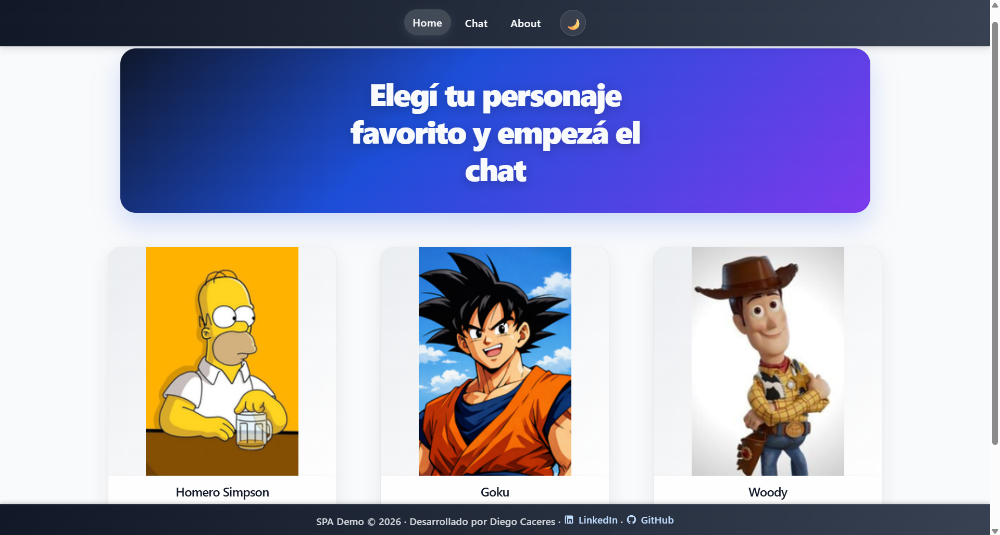
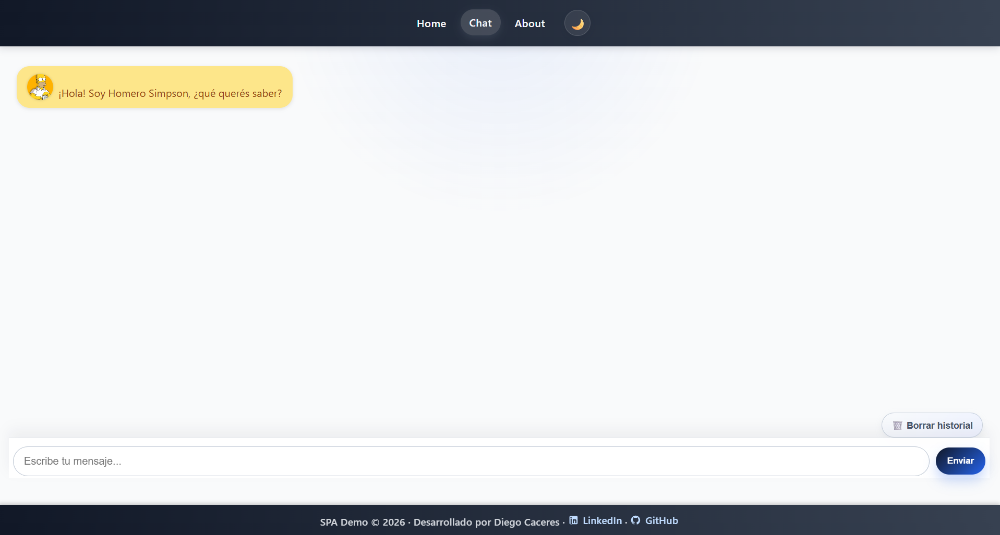
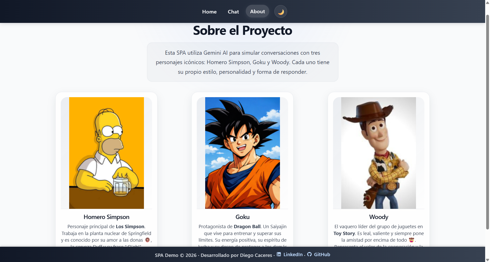

# Chat con Personajes AI

Aplicación SPA (Single Page Application) que permite conversar con personajes icónicos usando la API de Gemini.

La idea principal es combinar una experiencia de chat con personalidad diferenciada por personaje, manteniendo una interfaz simple, mobile-first y moderna.

## Descripción del proyecto

Este proyecto simula una experiencia de conversación con tres personajes populares:

- Homero Simpson: humor cotidiano, ingenuidad y frases icónicas.
- Goku: energía, entrenamiento y entusiasmo.
- Woody: liderazgo, amistad y protección.

Cada personaje tiene un prompt personalizado y un estilo visual propio en la UI, con mensajes renderizados con avatar y color distintivo.

La SPA está construida con Vite y JavaScript modular, y la parte de IA se comunica a través de una función serverless en Vercel.

---

## Link de la aplicación desplegada

La app publicada está disponible en:

https://project-root-weld.vercel.app

---

## Stack y estructura

- Vite + JavaScript vanilla
- Vitest para testing
- Gemini API via Google Generative AI
- Vercel serverless functions

Carpetas principales:

- `api/` → backend serverless para manejar la llamada a Gemini
- `src/views/` → vistas de Home, Chat, About, NotFound
- `src/ui/` → UI y estado visual
- `src/services/` → llamadas a API, historial y lógica de servicio
- `src/config/` → configuración centralizada de personajes
- `src/styles/` → estilos base, vistas, chat, navegación
- `tests/` → suite de pruebas

---

## Personajes elegidos

### Homero Simpson
- Carácter: humor, relax, espontáneo.
- Estilo: conversación casual y divertida.
- Avatar: /img/Homero.jpg

### Goku
- Carácter: positivo, energético, competitivo.
- Estilo: entusiasmo y entrenamiento.
- Avatar: /img/Goku.png

### Woody
- Carácter: protector, amigable, líder.
- Estilo: calidez y valor.
- Avatar: /img/Woody.jpg

---

## Requisitos

Necesitás tener instalado:

- Node.js 18 o superior
- npm
- Cuenta en Google AI / Gemini con API key
- Cuenta en Vercel para deploy

---

## Pasos para ejecutar localmente

1. Cloná el repositorio:

```bash
git clone https://github.com/caceresdiegoleonel1986/ProyectoM3_CaceresDiego.git
cd "ProyectoM3_CaceresDiego"
```

2. Instalá dependencias:

```bash
npm install
```

3. Creá un archivo `.env` en la raíz del proyecto:

```bash
GEMINI_API_KEY=tu_api_key_aqui
```

Puedes basarte en el archivo `.env.example`.

4. Ejecutá la app local con Vercel dev:

```bash
npx vercel dev
```

Esto levanta el entorno local con la API serverless y la SPA.

También podés correrlo con Vite:

```bash
npm run dev
```

La app normalmente queda en:

```text
http://localhost:5173/
```

---

## Cómo ejecutar tests

Este proyecto usa Vitest.

Para correr toda la suite:

```bash
npm test -- --run
```

También podés correr un archivo individual:

```bash
npx vitest run tests/chatIntegration.test.js
```

---

## Cómo desplegar en Vercel

1. Logueate en Vercel:

```bash
npx vercel login
```

2. Desde la raíz del proyecto:

```bash
npx vercel
```

3. Si querés deploy de producción:

```bash
npx vercel --prod
```

El proyecto ya incluye `vercel.json` para manejar rutas SPA y salida de Vite.

---


## Capturas de pantalla

### Home



### Chat



### About



---

## Registro del uso de IA en el proyecto

La integración con IA se realiza con Gemini a través de la función serverless en `api/chat.js`.

Flujo:

1. El usuario escribe un mensaje desde la vista Chat.
2. La app envía el mensaje y el personaje seleccionado.
3. El servidor recibe el payload y arma el contenido para Gemini.
4. La API responde con un texto generado.
5. La UI muestra la respuesta como mensaje con el estilo del personaje.

Este uso de IA permite:

- personalizar la respuesta por personaje
- mantener el historial de conversación por usuario
- combinar una experiencia de chat con una paleta visual diferenciada
- generar una SPA con comportamiento dinámico y moderno

---

## Licencia

Proyecto educativo y de práctica para el módulo 3 de Soy Henry.

---

## Conclusión

Este proyecto combina una SPA moderna, una selección de personajes, IA generativa y despliegue real en Vercel. Es una buena base para continuar agregando más personajes, mejores prompts, historial persistente y funcionalidades de UX avanzadas.